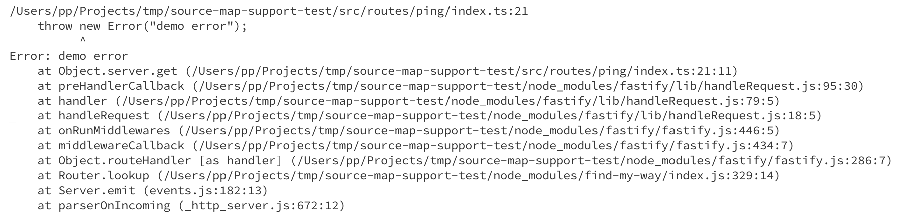
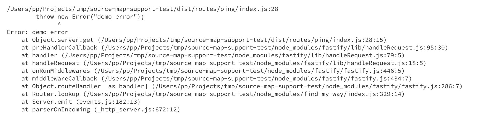

# config vs node-source-map-support module bug
[config](node-source-map-support) module does not play well with [node-source-map-support](https://github.com/evanw/node-source-map-support) when configs are stored as `ts` files.

## expected
(this happens when you have [./src/server.ts#21](./src/server.ts#L21) is commented out)

## actually happens

Pay attention, stack trace does not reference the actual `ts` files.
